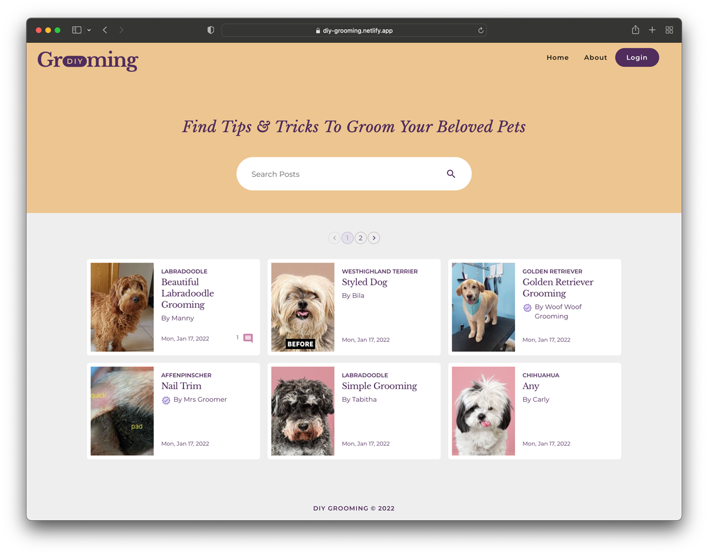
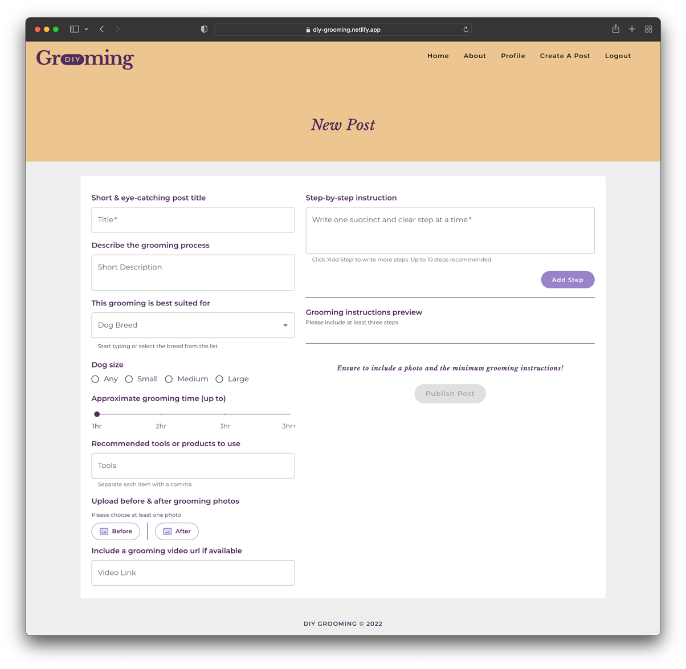
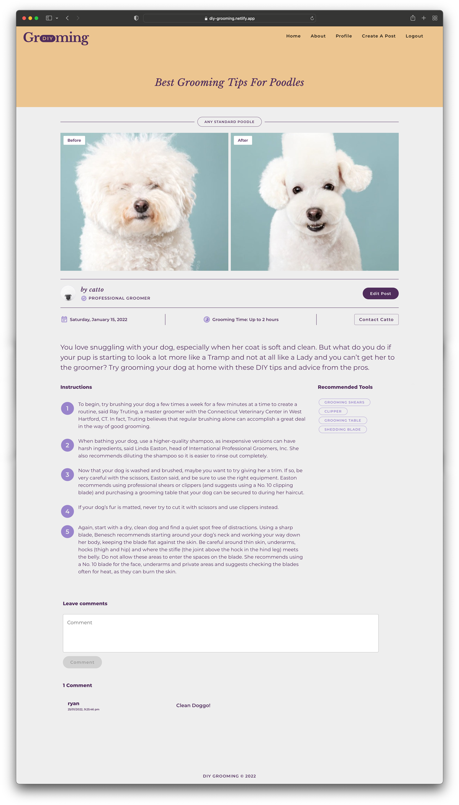

# DIY Grooming

Coder Academy FX1 Melbourne 2021 final project –– a team collaboration to create a full-stack web application.

### About the project

The Notting Hill neighbourhood management approached us to help them create an online blog dedicated to dog owners in the community.

The online blog is a platform to share and find step-by-step DIY dog grooming instructions. The Notting Hill neighbourhood community and anyone interested in DIY dog grooming can access the blog. Additionally, professional groomers can contribute and promote their services, and when needed, registered users can then contact them through the blog.

 &darr;  Please check Part A for more information about the project and planning process.

---

### Deployed Website

> 👉🏻   [**diy-grooming.netlify.app**](https://diy-grooming.netlify.app)

### Screenshots

&darr;  Home or landing page

&darr;  Create a new post form for registered users

&darr;  Single post page

### Workflow

We utilised the GitHub organisation to create a central 💦🐩✨ [DIY Grooming](https://github.com/DIYGrooming) repository for our team workflow. As a result, all members have access to better manage the separate sub-repositories (micro-sites) and help organise the full-stack project for team collaboration.

### Project Details & Microsites

Part A
------
🗂 Documentations  →  [DIY Grooming Docs](https://github.com/DIYGrooming/docs)

Part B
------

🏭  Server Side - Backend  →  [DIY Grooming Backend](https://github.com/DIYGrooming/server-backend)  

🖥  Client Side - Frontend  →  [DIY Grooming Frontend](https://github.com/DIYGrooming/client-frontend)  

---

### Responsibilities

As a team of four members, three of us, including me, are mainly responsible for looking after the front-end side. I helped set up the initial project repositories suitable for team collaboration, such as utilising extra configuration for linters and format on save (e.g., `prettier`) to enforce code format consistency. 

Being the only graphic designer, I also took the opportunity to create some high-fidelity wireframes to help other members visualise the design and provide guidance in styling. In addition to that, I managed to develop the global styling and theme for the blog to enforce style consistency and achieve a cohesive look.

### Personal Reflection

Communication has been the most challenging aspect of team collaboration. However, despite our limited individual skills and various personal circumstances, we worked well together and put up the current version of the blog on deployment! Indeed, there are still many improvements to be made. Some features have not been successfully implemented yet due to time constraints. 

The most enjoyable part for me was creating dynamic and modular components that are reusable and figuring out conditional rendering that can help improve the UI and UX. Moreover, implementing Material UI or MUI has been enjoyable, too, despite the hiccups here and there when other non-standard-text field components are used on the main form (create a post). 

Unfortunately, at this stage, I failed to successfully implement the complete CRUD for the post (missing the update and delete implementations). Hopefully, I can revisit the issues and fix them soon!

I also want to learn how to manage states better (especially `Redux`) and improve the site performance by fixing any memory leaks due to possible expensive API calls for loading the fetched data. Unit testing or test-driven development is the primary thing that we as a team want to improve and be good at, as, unfortunately, we're unable to implement it much in this project. Finally, working on this project made me want to explore JavaScript more, mainly the DOM, to understand better how things work in React. 

Nevertheless, it has been a hugely rewarding *"doing by learning"* experience. We all decided to build a MERN project–a stack that we didn't formally learn at the boot camp. Moreover, project management and team collaboration (especially `git`) are precious learning experiences. 
